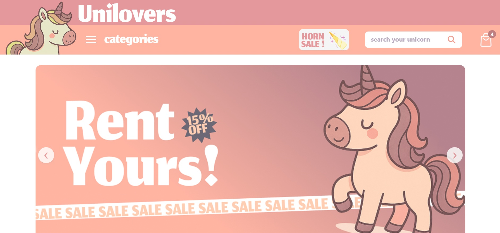
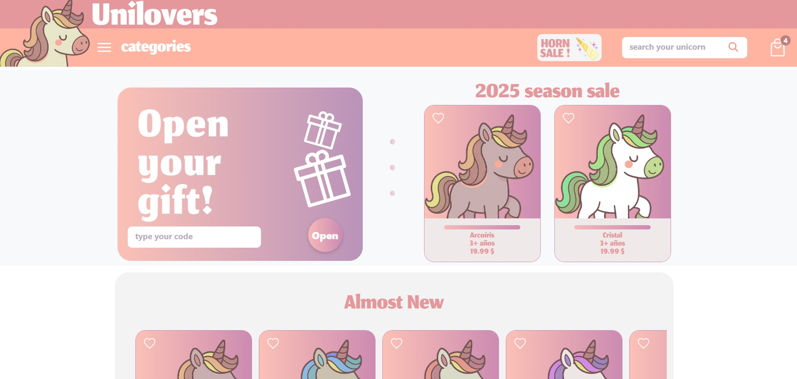

## 🦄 Unilovers Demo

A vibrant and whimsical demo showcasing the homepage of a fictional unicorn rental platform.

### 🌈 Description

This project is a front-end prototype of **Unilovers**, a unicorn rental site built with **React** and **Vite**. The application simulates the homepage of the platform and includes a variety of UI features and responsive behaviors.

All product and promotion data is stored in local `.json` files inside the repository, and the application fetches this data at runtime.

Both the **design and development were fully created by me**.

### 🌟 Features

- 🧭 Dual-section responsive navigation bar  
  ‣ Logo, menu, and dropdowns adapt based on screen size  
- 🎠 Hero main slider with different image versions for mobile and desktop  
- 🔥 **Special offer module** that automatically selects and displays the lowest-priced products  
- 🎁 Promo code input area  
  ‣ Entering the promo code `UNILOVER` triggers a celebratory modal with confetti animation (via a dedicated React library)  
- 💖 **Favorites system**  
  ‣ Users can add products to favorites  
  ‣ Favorites are saved in the browser's localStorage and persist after page reload  
- 🛒 Long horizontal product carousel, also fully responsive  
- 📬 Footer with newsletter signup and legal notice  
- 🎭 Placeholder UI elements (e.g. cart icon showing "4" items not yet functional)

### 🛠 Tech Stack

- React  
- Vite  
- Custom CSS + media queries  
- React-confetti (for celebration effects)  
- JSON-based local data  
- LocalStorage for persistent favorites

### 🎨 Original Design

Check out the original Figma file here:  
👉 [Unilovers – Figma Design](https://www.figma.com/design/bQF05H2ysFazMUquoalN8l/unilovers?node-id=4-409&t=PSFxl0kPDD5AGSN0-0)

### 📌 Notes

This is a front-end-only demo. All product and promotion data is loaded from local JSON files. Some features (like the cart) are currently placeholders and not yet connected to business logic.

Work in progress.

  
    

---

## 🦄 Unilovers Demo (Español)

Una demo vibrante y fantástica que simula la home de una plataforma ficticia de alquiler de unicornios.

### 🌈 Descripción

Este proyecto es un prototipo **front-end** de la página principal de **Unilovers**, un sitio imaginario dedicado al alquiler de unicornios. Fue desarrollado con **React** y **Vite**, y presenta varias secciones que combinan diseño e interactividad.

Los productos y las promociones están almacenados en archivos `.json` dentro del repositorio, y la aplicación hace **fetch de esos datos** para construir dinámicamente las vistas.

Tanto el **diseño como el desarrollo fueron realizados por mí**.

### 🌟 Funcionalidades

- 🧭 Barra de navegación dividida en dos secciones  
  ‣ El logo, menú y tipos de desplegables cambian según el tamaño de pantalla  
- 🎠 Slider principal con versiones diferentes para mobile y desktop  
- 🔥 **Módulo de oferta especial** que selecciona automáticamente los productos más baratos de la lista  
- 🎁 Área de ingreso de códigos promocionales  
  ‣ Si se ingresa el código `UNILOVER`, se abre un modal con papel picado (usando una librería específica de React)  
- 💖 **Sistema de favoritos**  
  ‣ El usuario puede guardar productos como favoritos  
  ‣ Los favoritos se almacenan en el navegador (localStorage) y se mantienen incluso al recargar la página  
- 🛒 Carrusel horizontal largo con todos los productos, adaptado a mobile y desktop  
- 📬 Footer con suscripción a newsletter y aviso legal  
- 🎭 Elementos de UI con funciones simuladas (como el ícono de carrito que muestra "4" sin funcionalidad real)

### 🛠 Tecnologías

- React  
- Vite  
- CSS personalizado + media queries  
- React-confetti  
- Datos almacenados en archivos JSON  
- LocalStorage para mantener favoritos

### 🎨 Diseño original

Podés ver el archivo original de Figma acá:  
👉 [Unilovers – Diseño en Figma](https://www.figma.com/design/bQF05H2ysFazMUquoalN8l/unilovers?node-id=4-409&t=PSFxl0kPDD5AGSN0-0)

### 📌 Notas

Este proyecto es solo una **demo de front-end**. Todos los datos se cargan desde archivos locales y no hay conexión a bases de datos. Algunas funcionalidades están simuladas o en desarrollo.

Trabajo aún en desarollo.

  
    

